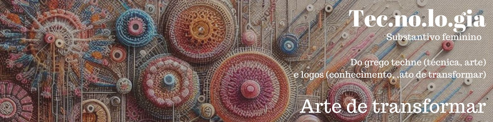

<td align="center"><a href="https://github.com/camilasukhada"> </a> </td>

# Olá, sou a Camila.

### Sobre mim:

    Sou Front-End Developer, uma curiosa nata e criativa com uma necessidade voraz de desenvolver ideias e criar soluções. Acredito no potencial da tecnologia em transformar a qualidade de vida das pessoas e gerar impactos positivos na sociedade, através do desenvolvimento de aplicações que promovam educação, inclusão e equidade. Meu objetivo é tornar produtos e serviços em soluções eficientes, acessíveis, que proporcionam boas experiências para os usuários. Essa é a inspiração para iniciar minha trajetória profissional na Tecnologia.

### Tecnologias e ferramentas:

&nbsp;
&nbsp;
&nbsp;
&nbsp;
&nbsp;
&nbsp;
&nbsp;

&nbsp;
&nbsp;
&nbsp;
&nbsp;

### Contatos:

